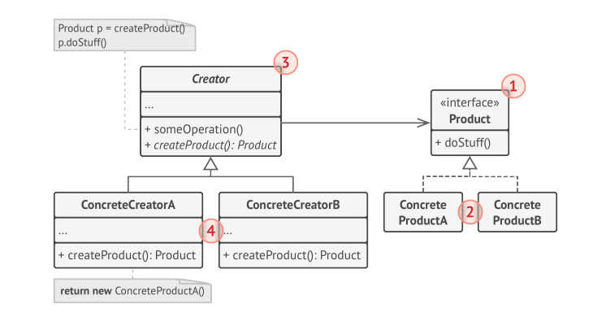
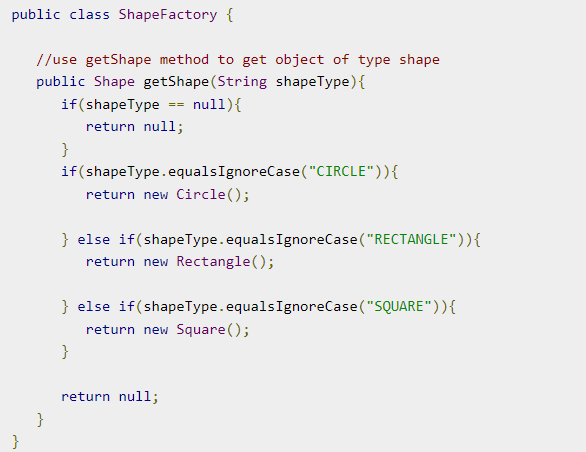

# FACTORY METHOD
_Also knows as: Virtual Constructor_

**Factory Method** is creational design pattern that provides an interface for creating objects in a superclass, but 
allows subclass to alter the type of objects that will be created.

## 1. Structure

## 2. Applicability
- When you don't know beforehand the exact types and dependencies of the object
- When you want to provide users of your library or framework with a way to extend its internal components.
- When you want to save system resources by reusing existing object instead of rebuilding them each time.

## 3. How to implement
- Make all products follow the same interface. This interface should declare methods that make sense in every product.
- Add an empty factory method inside the creator class. The return type of the method should match the common 
  product interface.
- Replace product constructors with call to the factory method.
  - You might need to add a temporary parameter to the factory method to control the type of returned product, example:
  
- Now, create a set of creator subclasses for each type of product listed in the factory method. Override the 
  factory method in the subclasses and extract  and extract the appropriate bits of construction code from the base 
  method.
- If there are too many product types, you can reuse the control parameter from the base class in subclasses.
- If, then all of the extractions, the base factory method has become empty, you can make it abstract. If there's 
  something left, you can make it a default behavior of the method.

## 4. Pros and Cons
**Pros**
- You avoid tight coupling between the creator and the concrete product
- Single Responsibility Principle
- Open/Closed Principle. You can introduce new types of products into the program without breaking existing client code.
- 
**Cons**
- The code may become more complicated since you need to introduce a lot of new subclass to implement the pattern.