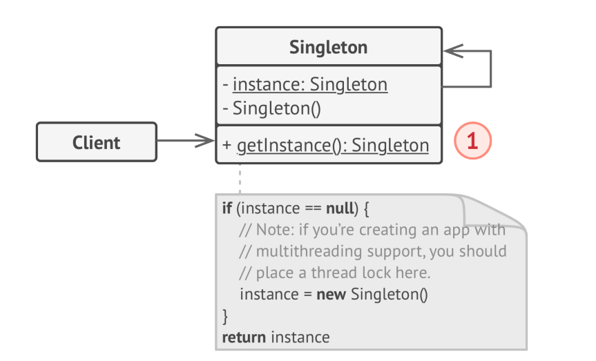

# Singleton Design Pattern
**Singleton** is ensure that a class has only one instance, while providing a global access point to this instance.

## 1. Structure

## 2. Applicability
- Use the Singleton pattern when a class in your program should have just a single instance available to all clients;
  - Example: a single database object shared by different parts of the program
- Use the Singleton pattern when you need stricter control over global variables.

## 3. How to implement
- Add private static field to the class for storing the singleton instance.
- Declare a public static method for getting the singleton instance.
- Implement "lazy initialization" inside the static method.
  - Create a new object on its first call and put it into the static field
  - Return instance on all subsequent calls
- Make the constructor of the class private. The static method of the class will still be able to call the constructor
- Go over the client code and replace all direct calls to the singleton's constructor with call to its static 
  creation method.

## 4. Pros and Cons
**Pros**
- Can be sure that a class has only a single instance.
- Gain a global access point to that instance.
- The singleton object is initialized only when it's requested for first time.

**Cons**
- Violates the Single Responsibility Principle. The pattern solves two problems at the time.
- Can mask bad design, when the components know too much about each other.
- Requires special treatment in a multithreaded environment.
- Difficult to unit test the client code.